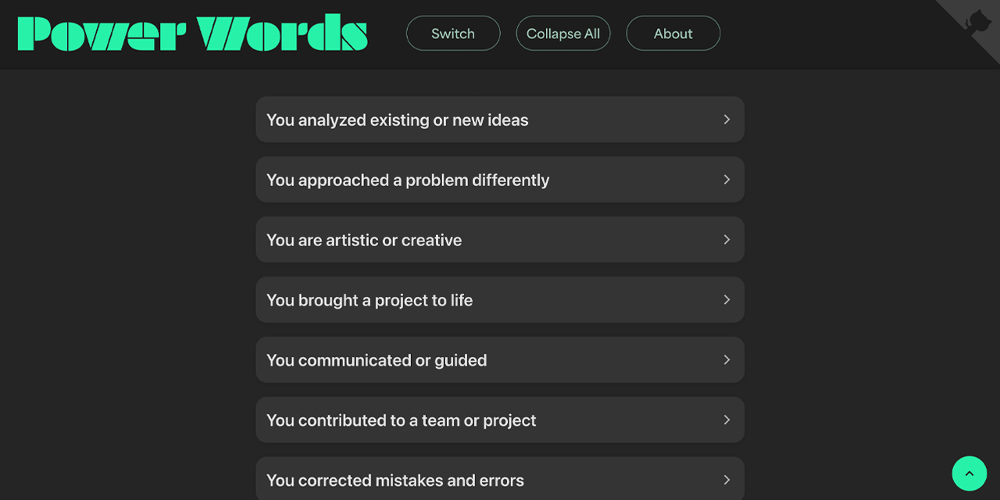

<p id="header"><p>

<table>
    <tr>
        <td><a href="https://github.com/emjose/candy-cocoa/#header"></a></td>
        <td><a href="https://github.com/emjose/one-hundred/#header"></a></td>
        <td><a href="https://github.com/emjose/power-words/#header"></a></td>
        <!-- <td><a href="https://github.com/emjose/****NEXT-REPO****/#header"></a></td> -->
    </tr>

</table>

<br>

<p id="power-words"><p>

<a href=#table-of-contents></a>

<br>

<a href="https://www.powerwords.work/"></a>

#

<p id="table-of-contents"><p>

<a href=#table-of-contents></a>

- [100 Days of Code](#100days)
- [Installation](#installation)
- [Live Site](#live-site)
- [Improvement](#improvement)
- [Resources](#resources)
- [Copyright](#copyright)
- [Let's Connect!](#lets-connect)

<br>

#

<p id="100days"><p>

<a href=#100days></a>

### Day 40: March 1, 2022

- Many websites and resources cover the topic of using action words, or **power words**, in a resume.

- Throughout my job hunt, I used resume word bank websites whenever I updated my resume.

- However, it was challenging to go through all of them and recall which site had which words or categories.

- With the help of [ChatGPT](https://chat.openai.com/), I created **[Power Words](https://www.powerwords.work/)** to consolidate these resources, and to offer a tool for anyone navigating the job hunt and looking to enhance their resume.

- Using an accordion structure, **[Power Words](https://www.powerwords.work/)** offers comprehensive word options categorized into a variety of skills, synonyms, experiences, and industries.

<br>

#

<p id="installation"><p>

<a href=#installation></a>

**Important Note**:

The files can be installed with the steps below, but due to repeat instances of copyright infringement by another developer, some of the files in this repository have been obfuscated.

#### 1. Git clone and cd into the repo folder:

```console
git clone git@github.com:emjose/power-words.git && cd power-words
```

#### 2. Run the command:

```console
open index.html
```

<br>

#

<p id="live-site"><p>

<a href="https://www.powerwords.work/"></a>

<a href="https://www.powerwords.work/"></a>
<sub><a href="https://www.powerwords.work/">Click the above image or the following GIFs to visit the Power Words website.<a/></sub>

<br>

- **[Power Words](https://www.powerwords.work/)** is responsive and can be viewed on mobile devices or computers.

- **[Power Words](https://www.powerwords.work/)** is keyboard-navigable and is a [progressive web app](https://developer.mozilla.org/en-US/docs/Web/Progressive_web_apps).

- There are 1,100+ unique power words across 62 categories of skills, synonyms, experiences, and industries.

- Each category (except the category of words to avoid) contain example resume sentences.

<a href=#live-site></a>

<details>
<summary><b>GIF demo: Opening and Closing Individual Categories</b></summary>
<br>

The categories can be individually opened or closed with a click or press of the accordion headers.

<br>

<a href="https://www.powerwords.work/"></a>

<br>

#

</details>

<details>
<summary><b>GIF demo: Copying Words to the Clipboard</b></summary>
<br>

Words in each category (except the category of words to avoid) can be clicked and copied to the clipboard.

<br>

<a href="https://www.powerwords.work/"></a>

<br>

#

</details>

<details>
<summary><b>GIF demo: Collapsing All Categories</b></summary>
<br>

Pressing the "Collapse" button in the header closes any and all open categories at once.

<br>

<a href="https://www.powerwords.work/"></a>

<br>

#

</details>

<details>
<summary><b>GIF demo: Modal Box</b></summary>
<br>

Users can view additional resume writing resources by clicking the "About" button in the header.

<br>

<a href="https://www.powerwords.work/"></a>

<br>

#

</details>

<details>
<summary><b>GIF demo: Dark Mode</b></summary>
<br>

Users can click the "Switch" button to change to dark or light mode, with preference saved in local storage.

<br>

<a href="https://www.powerwords.work/"></a>

</details>

<br>

#

<p id="improvement"></p>

<a href=#improvement></a>

**[Power Words](https://www.powerwords.work/)** can be improved in the following ways:

- Further refinement and editing of categories and words.

- Potential button menu or search bar to quickly filter or sort the categories.

- Potential icons or images to enhance each category.

- A feature to save or bookmark favorite power words.

- Integration with a dictionary or thesaurus API to search word definitions.

<br>

#

<p id="resources"><p>

<a href=#resources></a>

- #### [ChatGPT](https://chat.openai.com/)

- #### [340+ Resume Action Verbs & Power Words](https://novoresume.com/career-blog/top-10-most-powerful-action-words-for-resume)

- #### [Tips for Using Resume Keywords](https://www.thebalancemoney.com/resume-keywords-and-tips-for-using-them-2063331#:~:text=Your%20resume%20keywords%20should%20include,good%20fit%20for%20the%20job.)

- #### [185+ Action Verbs](https://www.themuse.com/advice/185-powerful-verbs-that-will-make-your-resume-awesome)

- #### [How to Write an ATS-Friendly Resume](https://www.jobscan.co/blog/20-ats-friendly-resume-templates/)

- #### [41 Resume Templates](https://www.themuse.com/advice/the-41-best-resume-templates-ever#2a49226e-e36c-400f-8caa-9d9475ef9cfa)

- #### [Autofill All Your Job Applications](https://simplify.jobs/autofill)

- #### [16 Software Engineer Resume Examples](https://resumeworded.com/software-engineer-resume-examples#entry-level-software-engineer)

- #### [Resume Worded Blog](https://resumeworded.com/blog/)

- #### [Cloudinary](https://cloudinary.com/)

- #### [Adobe Fonts](https://fonts.adobe.com/)

- #### [Adobe Photoshop](https://www.adobe.com/creativecloud/buy/students.html)

- #### [My blog on how I created my Github READMEs](https://emmanueljose.medium.com/readme-a-makeover-story-b9c7be37a6de?sk=7ae6623d365409d875753e4604e42ffd)

<br>

#

<p id="copyright"><p>

<a href=#copyright></a>

- © 2023 <a href="https://www.powerwords.work/">Power Words</a>. All Rights Reserved.

- Visual assets of this project and README are copyright of © <a href="https://www.emmanuel-jose.com/">Emmanuel Jose</a>. All Rights Reserved.

<br>

#

<p id="lets-connect">

<a href=#lets-connect></a>

<p><a href="https://twitter.com/Emmanuel_Labor"></a> <a href="https://www.linkedin.com/in/emmanuelpjose/"></a> <a href="https://emmanueljose.medium.com/"></a> <a href="https://www.instagram.com/emmanuel_jose/"></a> <a href="mailto:emjose@gmail.com"></a> <a href="https://www.emmanuel-jose.com/"></a> <a href="https://github.com/emjose"></a></p>

#

<a href=#header></a>
